<div align="center">

# ✨ MailPrism ✨

**Intelligent email classification using AI**

_Turn chaos into clarity — organize your emails with the power of Artificial Intelligence_

---


</div>

---

## 📋 Table of Contents

- [✨ MailPrism ✨](#-mailprism-)
  - [📋 Table of Contents](#-table-of-contents)
  - [🚀 About the Project](#-about-the-project)
    - [What is a Productive email?](#what-is-a-productive-email)
    - [What is an Unproductive email?](#what-is-an-unproductive-email)
  - [✨ Features](#-features)
  - [🛠️ Technologies Used](#️-technologies-used)
    - [Backend](#backend)
    - [Frontend](#frontend)
  - [🔄 Architecture and Workflow](#-architecture-and-workflow)
    - [Detailed Flow](#detailed-flow)
  - [💻 How to Run Locally](#-how-to-run-locally)
    - [Prerequisites](#prerequisites)
    - [Backend (Python/FastAPI)](#backend-pythonfastapi)
    - [Frontend (Next.js)](#frontend-nextjs)
  - [🔐 Environment Variables](#-environment-variables)
    - [Backend (`.env`)](#backend-env)
    - [Frontend (`.env.development`)](#frontend-envdevelopment)
  - [🏢 Benefits for Companies and Users](#-benefits-for-companies-and-users)
    - [For Companies](#for-companies)
    - [For Individual Users](#for-individual-users)
  - [📡 API Endpoints](#-api-endpoints)
    - [`POST /analyze`](#post-analyze)
    - [`POST /analyze-text`](#post-analyze-text)
    - [`POST /refine-answer`](#post-refine-answer)
    - [`GET /`](#get-)
  - [🌟 Contributions](#-contributions)

---

## 🚀 About the Project

**MailPrism** is an intelligent email classification application that uses the power of **Google Gemini AI** to automatically analyze and categorize your emails into **Productive** or **Unproductive**.

### What is a Productive email?

Emails that require an action or response, such as:

- Support requests
- Updates on open cases
- Questions and inquiries

### What is an Unproductive email?

Emails that **do not** require an action or response, such as:

- Congratulations
- Simple thank-you notes
- Informational newsletters

In addition to classification, MailPrism offers:

- 📊 **Urgency level** (0-100%)
- 📝 **Detailed analysis** of the context and sender's intention
- 💡 **Response suggestions** professionally generated automatically
- 🎨 **Custom categories** defined by the user
- 🔒 **Sensitive data masking** (CPF, emails) for privacy protection

---

## ✨ Features

| Feature                         | Description                                                     |
| ------------------------------- | --------------------------------------------------------------- |
| 📄 **PDF Upload**               | Upload emails in PDF format for analysis with NLP preprocessing |
| 📝 **TXT Upload**               | Support for plain text files                                    |
| ⌨️ **Text Input**               | Paste email content directly into the interface                 |
| 🏷️ **Automatic Categorization** | Classification as Productive/Unproductive or custom categories  |
| ⚡ **Urgency Indicator**        | Urgency percentage based on content                             |
| 💬 **Response Suggestion**      | Professional response suggested by AI                           |
| ✏️ **Response Refinement**      | Adjust the response tone (formal, casual, empathetic)           |
| 🎨 **Custom Colors**            | Automatic colors for custom categories                          |
| 🔒 **Data Masking**             | Automatic CPF and email masking for sensitive data protection   |
| 🧠 **NLP Processing**           | Text cleaning, lemmatization, and stopword removal for PDFs     |

---

## 🛠️ Technologies Used

### Backend

| Technology            | Use                                                |
| --------------------- | -------------------------------------------------- |
| **Python 3.x**        | Main backend language                              |
| **FastAPI**           | High-performance web framework for APIs            |
| **Uvicorn**           | ASGI server to run the application                 |
| **Gunicorn**          | WSGI HTTP server for production deployment         |
| **pypdf**             | PDF text extraction library                        |
| **spaCy**             | NLP library for text cleaning and lemmatization    |
| **Google Gemini API** | AI engine for analysis and classification          |
| **Pydantic**          | Data validation and schemas                        |

### Frontend

| Technology         | Use                                      |
| ------------------ | ---------------------------------------- |
| **React 19**       | Library for building interfaces          |
| **Next.js 16**     | React framework with SSR and routing     |
| **TypeScript**     | Static typing for JavaScript             |
| **Tailwind CSS 4** | Utility-first CSS framework              |
| **Axios**          | HTTP client for API requests             |
| **Sonner**         | Elegant toast notifications              |
| **React Icons**    | Icons for the interface                  |

---

## 🔄 Architecture and Workflow

```mermaid
flowchart TD
    User["👤 USER"]
    Frontend["🖥️ NEXT.JS FRONTEND"]
    Backend["⚙️ FASTAPI BACKEND"]
    File["📎 File<br/>PDF/TXT/TEXT"]
    
    PDFUpload["📄 PDF UPLOAD"]
    TXTUpload["📝 TXT/TEXT UPLOAD"]
    
    PyPDF["📚 PYPDF<br/>(Text Extract)"]
    ProcessPipeline["🔄 GENERAL PROCESS SERVICE<br/>(process_text_pipeline)"]
    
    NLP["🧠 NLP SERVICE<br/>(spaCy)<br/>• Clean text<br/>• Mask CPF<br/>• Mask emails<br/>• Lemmatize<br/>• Stopwords"]
    
    Gemini["✨ GEMINI API<br/>(AI Analysis)"]
    
    Response["📊 JSON RESPONSE<br/>• category: Productive/Unproductive/Custom<br/>• urgency: 0.0 - 100.0<br/>• reason: Detailed analysis<br/>• answerSuggestion: Professional response<br/>• categoryColor: Hex color"]
    
    User -->|Upload| File
    User -->|Axios| Frontend
    Frontend -->|HTTP Request| Backend
    
    Backend --> PDFUpload
    Backend --> TXTUpload
    
    PDFUpload -->|Extract Text| PyPDF
    PyPDF --> ProcessPipeline
    TXTUpload --> ProcessPipeline
    
    ProcessPipeline --> NLP
    NLP --> Gemini
    Gemini --> Response
    Response -->|Display Results| Frontend
```



### Detailed Flow

1. **User Input**
   - The user uploads a PDF/TXT file or pastes email text directly
   - Optionally, defines custom categories with name and description

2. **Frontend Processing (Next.js)**
   - The interface captures the file or text
   - Creates a `FormData` with the file and custom categories
   - Sends via Axios to the FastAPI backend

3. **Backend Processing (FastAPI)**
   - **For PDFs**:
     1. **pypdf** extracts raw text from the PDF document
     2. **General Process Service** calls the unified `process_text_pipeline`
   - **For TXT files**:
     1. Content is decoded from UTF-8
     2. **General Process Service** calls the unified `process_text_pipeline`
   - **Unified Text Pipeline (`process_text_pipeline`)**:
     1. **NLP Service (spaCy)** cleans the text:
        - Unicode normalization
        - Masks sensitive data (CPF, email addresses)
        - Removes artifacts and non-printable characters
        - Normalizes whitespace
     2. **NLP Service (spaCy)** lemmatizes and filters:
        - Lemmatizes words (converts to root form)
        - Removes stopwords and punctuation
     3. Applies a 15,000 character limit for stability
     4. Processed text is sent to Gemini API
   - **For Raw Text (`/analyze-text`)**: Content is sent directly to Gemini API (no NLP preprocessing)

4. **AI Analysis (Google Gemini)**
   - Gemini analyzes the email content
   - Classifies as Productive/Unproductive or custom category
   - Calculates the urgency level
   - Generates a detailed analysis and response suggestion

5. **Response to User**
   - The frontend displays the classification with visual indicator
   - Shows the urgency bar
   - Presents the detailed analysis and response suggestion

---

## 💻 How to Run Locally

### Prerequisites

- **Python 3.10+** installed
- **Node.js 18+** installed
- **npm** or **yarn**
- A **Google Gemini API key** ([Get one here](https://aistudio.google.com/app/apikey))

---

### Backend (Python/FastAPI)

1. **Navigate to the backend folder**

   ```bash
   cd backend
   ```

2. **Create and activate the virtual environment**

   ```bash
   # Create the virtual environment
   python -m venv .venv

   # Activate on Linux/macOS
   source .venv/bin/activate

   # Activate on Windows (PowerShell)
   .\.venv\Scripts\Activate.ps1

   # Activate on Windows (CMD)
   .\.venv\Scripts\activate.bat
   ```

3. **Install dependencies**

   ```bash
   pip install -r requirements.txt
   ```

4. **Download spaCy Portuguese model**

   ```bash
   python -m spacy download pt_core_news_sm
   ```

   > Note: The application will auto-download this model if not present, but manual installation is recommended.

5. **Configure environment variables**

   ```bash
   # Create the .env file
   cp .env.example .env

   # Edit the file and add your Gemini key
   # GEMINI_API_KEY=your_key_here
   ```

6. **Run the server**

   ```bash
   uvicorn controllers.main:app --reload
   ```

   The backend will be available at: `http://localhost:8000`

---

### Frontend (Next.js)

1. **Navigate to the frontend folder**

   ```bash
   cd frontend
   ```

2. **Install dependencies**

   ```bash
   npm install
   # or
   yarn install
   ```

3. **Configure environment variables**

   ```bash
   # Check the .env.development file
   # It should contain:
   # NEXT_PUBLIC_API_URL=http://localhost:8000
   ```

4. **Run the development server**

   ```bash
   npm run dev
   # or
   yarn dev
   ```

   The frontend will be available at: `http://localhost:3000`

---

## 🔐 Environment Variables

### Backend (`.env`)

| Variable         | Description           | Required |
| ---------------- | --------------------- | -------- |
| `GEMINI_API_KEY` | Google Gemini API key | ✅ Yes   |

### Frontend (`.env.development`)

| Variable              | Description         | Required |
| --------------------- | ------------------- | -------- |
| `NEXT_PUBLIC_API_URL` | FastAPI backend URL | ✅ Yes   |

---

## 🏢 Benefits for Companies and Users

### For Companies

| Benefit                         | Impact                                                     |
| ------------------------------- | ---------------------------------------------------------- |
| ⏱️ **Time Savings**             | Reduce email sorting time by up to 70%                     |
| 📊 **Automatic Prioritization** | Focus on what really matters with urgency indicators       |
| 🤖 **Standardized Responses**   | Maintain consistency in communications with AI suggestions |
| 📈 **Productivity**             | More efficient teams with fewer unproductive emails        |
| 🎯 **Custom Categorization**    | Adapt to your business-specific needs                      |
| 🔒 **Data Privacy**             | Automatic masking of sensitive information (CPF, emails)   |

### For Individual Users

| Benefit                    | Impact                                                  |
| -------------------------- | ------------------------------------------------------- |
| 🧘 **Less Overload**       | Instantly know which emails need attention              |
| 💡 **Quick Responses**     | Use response suggestions to speed up your communication |
| 🎨 **Intuitive Interface** | Modern and pleasant user experience                     |
| 📱 **Flexibility**         | Analyze PDF, TXT, or plain text                         |

---

## 📡 API Endpoints

### `POST /analyze`

Analyzes a PDF or TXT file. Both file types go through NLP preprocessing via the unified `process_text_pipeline` (text cleaning, lemmatization, stopword removal).

**Request:**

```bash
Content-Type: multipart/form-data

file: <PDF or TXT file>
customCategories: <JSON string with custom categories>
```

**Response:**

```json
{
  "category": "Productive",
  "urgency": 75.5,
  "reason": "Detailed email analysis...",
  "answerSuggestion": "Dear Sir/Madam, thank you for reaching out...",
  "categoryColor": null
}
```

---

### `POST /analyze-text`

Analyzes raw text directly (no NLP preprocessing).

**Request:**

```json
{
  "text": "Email content for analysis..."
}
```

**Response:** Same format as the `/analyze` endpoint

---

### `POST /refine-answer`

Refines a response suggestion with a specific tone.

**Request:**

```json
{
  "answer": "Current response text",
  "refine_type": "formal | casual | empathetic"
}
```

**Response:**

```json
{
  "refinedAnswer": "Refined response..."
}
```

---

### `GET /`

Server health check (returns ASCII art 😺).

---

<div align="center">

## 🌟 Contributions

Contributions are welcome! Feel free to open issues and pull requests.

---

**Made with ☕ by myself**

_MailPrism • Intelligent email classification_

</div>
